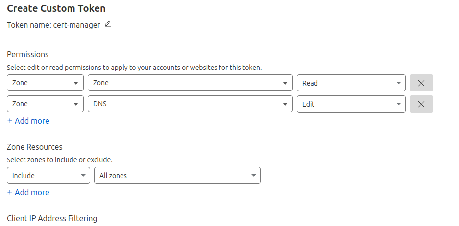
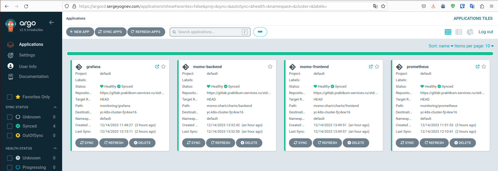

# momo-infrastructure

Контакт: https://app.pachca.com/chats/6026813  
ping: @ognev

## Основные сервисы

- Приложение: [momo.sergeyognev.com](https://momo.sergeyognev.com)
- ArgoCD: [argocd.sergeyognev.com](https://argocd.sergeyognev.com)
- Grafana: [grafana.sergeyognev.com](https://grafana.sergeyognev.com)
- Prometheus: [prometheus.sergeyognev.com](https://prometheus.sergeyognev.com)
- Репозиторий с кодом приложения: [GitLab](https://gitlab.praktikum-services.ru/std-017-008/momo-store)

## Структура проекта

```
├── kubernetes
│   ├── argo
│   ├── backend
│   ├── certificate
│   └── frontend
├── momo-chart
│   └── charts
│       ├── backend
│       │   └── templates
│       └── frontend
│           └── templates
├── monitoring
│   ├── alertmanager
│   │   └── templates
│   ├── grafana
│   │   ├── dashboards
│   │   └── templates
│   └── prometheus
│       ├── rules
│       └── templates
├── terraform-k8s
└── terraform-s3
```

1. kubernetes
   1. argo - манифест для Igress argo
   2. backend - манифесты для деплоя backend
   3. certificate - манифесты для автоматического выпуска и обновления TLS сертификата
   4. frontand - манифесты для деплоя frontend
2. momo-chart - Helm чарты для деплоя приложения, используются ArgoCD
3. monitoring - Копия созданых яндексом чартов сервисов мониторинга. Основное изменение.
внесенное в чарты - замена хостов в Ingress и добавление сертификата
4. terraform-k8s - IaC файлы для создания managed k8s кластера в Яндекс Облаке
5. terraform-s3 - IaC файлы для создания Object Storage в Яндекс Облаке

## Деплой

### Создание k8s кластера
1. Установить [yc CLI](https://cloud.yandex.com/en/docs/cli/quickstart) и зарегистрироваться
2. Узнать токен:
```bash
yc config list
```
3. Добавить токен в переменную
```bash
export YC_TOKEN=<your token>
```
4. Перейти в директорию `terraform-k8s`
5. Выполнить следующие команды
```bash
terraform init
```

```bash
terraform plan
```

```bash
terraform apply
```

### Создание Object Storage

1. Перейти в директорию `terraform-s3`
2. Выполнить следующие команды

```bash
terraform init
```

```bash
terraform plan
```

```bash
terraform apply
```

### Cert-manager

Для того чтобы приложение получило TLS сертификат от Let's Encrypt будет использоваться Cert-Manager и DNS01-challenge. В результате будет получен wildcard-сертификат для всех доменов `*.sergeyognev.com`. DNS-провайдером является Cloudflare.

1. Установть cert-manager
```bash
kubectl apply -f https://github.com/cert-manager/cert-manager/releases/download/v1.13.3/cert-manager.yaml
```

2. Проверить что cert-manager установлен корректно
```bash
kubectl get pods --namespace cert-manager
```

3. Получите Cloudflare API token на сайте Cloudflare, добавьте его в `kubernetes/certificate/cloudflare-api-token.yaml` и создайте секрет. Токен должен обладать следующими правами:



```bash
kubectl apply -f cloudflare-api-token.yaml
```
Т.к. в секрете используется поле `stringData`, токен должен быть добавлен как текст. БЕЗ `base64` encode

4. Установите cluster issuer

```bash
kubectl apply -f clusterissuer-prod.yaml
```

Сначала рекомендуется установить staging cluster issuer, для того чтобы не привысить Let's Encrypt лимиты. Если испытание будет пройдено успешно, замените `staging` на `prod`.

5. Проверьте cluster issuer
```bash
kubectl get clusterissuer
```

```bash
kubectl describe clusterissuer <name>
```

6. Добавьте wildcard certificate
```bash
kubectl apply -f wildcard-certificate.yaml
```

7. Проверьте certificate

```bash
kubectl get certificate
```

8. Для устранения багов изучите лог испытания (при необходимости)
```bash
kubect describe challenge
```

### Установка ArgoCD

1. Установите ArgoCD
2. 
```bash
kubectl create namespace argocd
```

```bash
kubectl apply -n argocd -f https://raw.githubusercontent.com/argoproj/argo-cd/stable/manifests/install.yaml
```

2. Создайте Ingress для ArgoCD

```bash
kubectl apply -f argo/argo-ingress.yaml
```

3. Скопируйте сертификат из `default` namespace в `argocd` namespace (Самый глупый метод, который пришел в голову)
	1. Выведите сертификат в консоль
	2. Скопируйте все данные в новый `yaml` файл
	3. Измените namespace в файле
	4. Создайте секрет в новом namespace

```bash
kubectl get secret sergeyognev-com-tls -oyaml
```

4. Дефолтный пароль для ArgoCD
 
```bash
argocd admin initial-password -n argocd
```

5. Зарегестрируйтесь через CLI
```bash
argocd login argocd.sergeyognev.com
```
6. Добавьте ваш кластер
```bash
argocd cluster add <context name> --server argocd.sergeyognev.com
```

### Деплой приложения
1. Добавьте ваш GitLab репозиторий в ArgoCD
2. Установите приложения из чарта
3. Должен получиться следующий результат:



### Установка систем мониторинга и логирования

1. Перейдите в директорию `monitoring`
2. Установите ClusterRoleBinding для того чтобы Prometheus мог увидеть информацию от приложения
```bash
kubectl apply -f access.yaml
```
3. Установите Prometheus
```bash
helm upgrade --atomic --install prometheus prometheus 
```
4. Установите Grafana
```bash
helm upgrade --atomic --install grafana grafana 
```
5. [Установите](https://grafana.com/docs/loki/latest/setup/install/helm/install-monolithic/) Loki
```bash
helm install --values loki.yaml loki grafana/loki
```
6. [Установите](https://grafana.com/docs/loki/latest/send-data/promtail/installation/) Promtail
```bash
helm upgrade --install promtail grafana/promtail
```